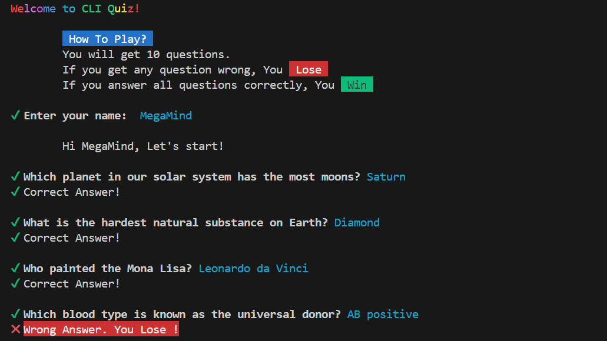

# 🎯 CLI Quiz  

A **Command Line Quiz Application** built using **Node.js**. This interactive quiz prompts users with multiple-choice questions and checks their answers.  

## 📸 Sample Screenshot  
 

## 📌 Features  
✅ Asks **5 random** questions every time  
✅ Validates answers and provides feedback  
✅ Simple and lightweight CLI application  

## 🚀 Installation  

1. Clone this repository:  
   ```sh
   git clone https://github.com/your-username/cli-quiz.git  
   ```

   Change Directory:
   ```sh
   cd cli-quiz
   ```

   Install Dependencies:
   ```sh
   npm install
   ```

   Take the Quiz
   ```sh
   node index.js
   ```
